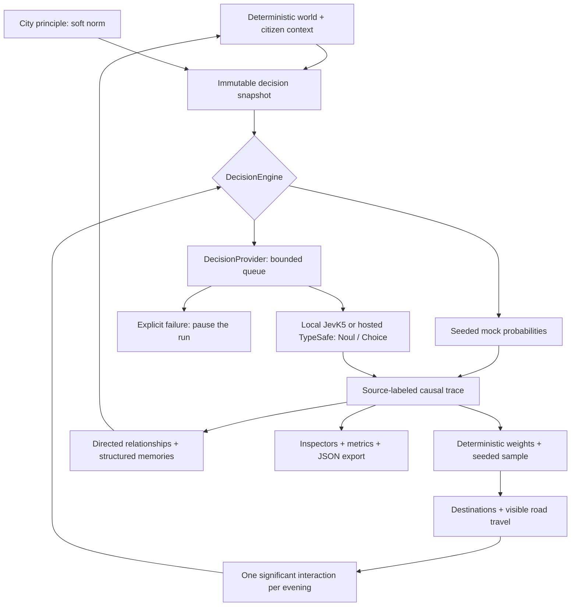

# Fuzzy City — One Thousand Evenings

1,000 simulated citizens. No generated dialogue. A Canvas city where typed probabilistic judgments shape evenings, encounters and tomorrow’s relationships.

Inference goes through a server-side `DecisionProvider` using the TypeSafe `/v1/systemone` contract. The documented hosted setup uses Vercel AI Gateway; an unset provider still defaults to local JevK5 v0.2.0. Traces distinguish local JevK5, hosted Jev, mock and historical fallback evaluations. Counters count returned questions, never projected usage.

## Run locally

Node.js 22.13+ and pnpm 11+:

```sh
pnpm install
# In a separate PowerShell terminal, start the installed local model:
# & .\scripts\start-jevk5.ps1
pnpm dev
```

Open [localhost:3000](http://localhost:3000). The city begins at day 1, 16:30. It runs automatically; use **Skip to evening** to process the intervening minutes and evaluations. Click a citizen (or press Enter on the focused Canvas), inspect the real probabilities, and follow relationship history. Drag to pan, scroll or use +/− to zoom.

**Save on this device** writes a checkpoint to IndexedDB. Daily checkpoints are automatic. On reload, **Resume saved day…** restores the saved world and RNG, paused. **Export run** downloads JSON containing the complete run and trace history. Browser storage is local and best-effort; use exports for durable research records.

For the installed GPU setup, see [local JevK5](docs/jevk5-local.md). To develop without a running GPU backend, explicitly set `DECISION_PROVIDER=mock` in `.env.local`. A missing local backend pauses the simulation; it does not silently switch to mock.

Open [the benchmark lab](http://localhost:3000/benchmark), or run `pnpm benchmark`, to measure actual 100/250/500/1000-citizen workloads. See [methodology and measured results](docs/benchmark.md).

The local GPU startup now uses verified FLA/Triton kernels and pinned BF16 weights. See [GPU optimization measurements](docs/gpu-optimization.md) for the 1.4–1.5× fixed-input gain, numerical differences and rollback instructions.

## What Jev does

Jev supplies five Noul probabilities for evening intentions, a full Choice distribution for friend selection, and four Noul probabilities per encounter. It does not generate people, prose, movement, money or world state.

## What ordinary code does

Seeded world generation, the clock, road movement, salary, energy, capacity reservations, scheduling, positive activity weights, normalization, RNG sampling, directed affinity arithmetic, bounded memories, binary entropy, persistence and rendering.



This architecture asks what happens when semantic judgment becomes a primitive inside ordinary software. Probabilities remain visible rather than being hidden behind generated explanations. An intention trace stores five answers, six raw weights, the normalized distribution, the RNG draw and sampled action. Interaction traces link to both participants’ intention traces; relationship deltas and memories link back to the interaction.

## Decision backend

For hosted Jev, put this in `.env.local` (also shown in `.env.example`):

```dotenv
JEV_PROVIDER=vercel
AI_GATEWAY_API_KEY=<your Vercel AI Gateway key>
```

The server uses the key to call `https://ai-gateway.vercel.sh/typesafe/v1/systemone` with model `typesafe-ai/jev`. The browser only calls `/api/jev/batch`; it never receives a backend credential. The provider boundary accepts `model`, shared `state` and named typed `questions`, and validates the official TypeSafe Noul/Choice answer envelope, full distributions and token usage. `MockDecisionProvider` implements the same boundary. The [Gateway's TypeSafe-compatible API](https://vercel.com/docs/ai-gateway/sdks-and-apis/typesafe) preserves this request and response format.

For local inference, use `JEV_PROVIDER=jevk5` with the values in [`config/jevk5.env.example`](config/jevk5.env.example); no key is needed. Direct TypeSafe access remains available with `JEV_PROVIDER=typesafe` and `TYPESAFE_API_KEY`. `DECISION_PROVIDER` remains a legacy alias when `JEV_PROVIDER` is absent; `JEV_MODE=mock|live` remains recognized after that. Vercel mode pins the Gateway endpoint and model, even if older `DECISION_API_BASE_URL` or `DECISION_MODEL` values remain in `.env.local`.

The local server serializes inference on one GPU, so one in-flight request is the default. Concurrency is configurable from 1 to 8 for stress testing. The application queue is bounded, order-preserving, and pauses the clock at decision boundaries while rendering continues. HTTP 429/5xx use at most three attempts with bounded backoff. Local socket timeouts are not retried into duplicate GPU work. Invalid responses or exhausted failures stop the run, with no mock substitution. Benchmark cancellation drains admitted inference and skips queued work.

Hosted providers use the existing bounded queue and retry policy. Existing fallback traces remain readable; the old hosted compatibility helper is not used by the application.

API totals count acknowledged upstream attempts. Tokens come from validated response usage. Set the optional configured token prices only for hosted inference; local GPU work is not a paid API call. The adapter follows the [official TypeSafe contract](https://docs.typesafe.ai/api).

## Simulation conventions

- Default seed: `fuzzy-city-001`. One-minute ticks; base UI speed is approximately one simulated minute per 220 ms, reduced by evaluation latency. 2× and 4× process more ticks, never drop evaluations.
- Exactly 1,000 adults, 272 residences, 40 workplaces, 8 cafés, 3 parks, a plaza, gallery and 3 landmarks; eight neighborhoods.
- Intentions are staggered across 50 minutes (20 citizens/minute at population 1,000), 17:00–17:49. Friend selection resolves at 18:00. Social groups pair in seeded order every 15 minutes from 19:00 to 22:45. Each citizen has at most one significant interaction per evening.
- A sampled friend visit with eligible contacts gets a Choice evaluation. With no eligible contacts, code redirects to a café and records a resolution event without counting a model judgment (JevK5 requires at least two Choice options). Up to five positive, unreserved contacts who are not themselves planning visits are eligible. `none` redirects to an available café. Selected hosts accept a deterministic home visit and change destination; this **schedule resolution is stored separately from their original sampled intention**. Disjoint reservations make a direct visit a guaranteed encounter after both arrive.
- Café/park/exploration destinations reserve capacity in citizen order. Friendship means directed affinity > 0.35 and familiarity > 0.20; displayed friendship totals count directed bonds, not mutual pairs.
- All days currently use the same work routine. Money is intentionally simple: deterministic salary and a café charge of up to €6. There is no market or traffic model.
- Mock cultural effects are a small keyword heuristic for the supplied presets, not semantic understanding. Local JevK5 and hosted Jev receive the complete principle as a soft norm. Changes apply only to subsequent snapshots.
- Binary entropy is recorded for each Noul answer. Citizen uncertainty uses their latest five intention judgments; city uncertainty is the mean of all Noul judgments returned that day. Choice is excluded from this binary metric.
- Memories retain the latest 12 memorable encounters per citizen. Full traces, relationship history and events remain in the run for analysis. Long-running sessions therefore grow in memory and export size.
- `createdAt` in a trace is a deterministic **absolute simulation minute**, not a wall-clock timestamp. Live latency and token metadata naturally differ between executions. Mock world state can be resumed exactly from its saved RNG state.

## Layout and modules

`src/sim/` is ordinary TypeScript with no React dependency. `src/ai/` contains the `DecisionProvider` abstraction, HTTP and deterministic mock providers, provider-to-simulation adapter, browser transport, typed wire contract and bounded server pool. `src/benchmark/` runs measured simulations, queue telemetry, GPU sampling and JSON reports. `src/components/` owns Canvas drawing and progressively disclosed inspectors. The map caches its background and animates 1,000 marks in one Canvas; React renders only UI panels. Desktop and mobile use the same simulation; the mobile citizen inspector becomes a bottom sheet.

## Verify

```sh
pnpm typecheck
pnpm test
pnpm exec playwright install chromium webkit
pnpm build
pnpm test:browser
```

The tests cover seed identity, exactly 1,000 citizens, formulas and sampling, entropy, mock determinism, historical snapshot integrity, checkpoint replay, eleven complete evening evaluations, movement, bounded states/memories, changing relationships, once-per-evening encounters, truthful counters, API schema/Choice validation, retries and concurrency. Browser flows exercise pause/resume, real Canvas picking, probability bars, relationships, principle editing, export and overflow in Chromium and WebKit at 1440×900 and 390×844. Screenshots are written to `test-results/` for visual inspection.

## Deploy

Deploy as a **Node.js Next.js application**, not a static export; live mode needs the API route. The current stable Next.js and React versions are resolved in `pnpm-lock.yaml`.

```sh
pnpm install --frozen-lockfile
pnpm build
pnpm start
```

Or use the included Dockerfile and set runtime environment variables:

```sh
docker build -t fuzzy-city .
docker run --rm -p 3000:3000 --env-file .env.local fuzzy-city
```

Next-compatible hosting can use `pnpm build` and the same runtime variables. For remote providers, allow route executions up to 120 seconds. To reach a host GPU from Docker Desktop, explicitly set `DECISION_API_BASE_URL=http://host.docker.internal:8090`; the default localhost URL refers to the container itself. The concurrency cap is **per server process**, not global across horizontally scaled replicas. Public live deployments should apply infrastructure rate/spend limits to `/api/jev/batch`; there are deliberately no accounts or application authentication in v0.1. Use `DECISION_PROVIDER=mock` for a public demo without a GPU or API. Benchmark coordination is a local, long-lived Node process feature; it is not supported on serverless functions. Keep the benchmark endpoint behind a local/trusted server boundary.

Fonts use Google Fonts with local system fallbacks. No generated media, analytics, dialogue, database or external client-side AI calls are included.
