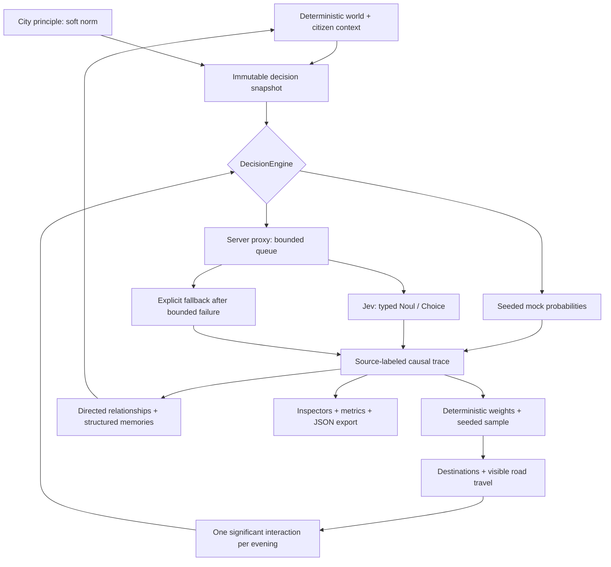

# Fuzzy City — One Thousand Evenings

1,000 simulated citizens. No generated dialogue. A Canvas city where typed probabilistic judgments shape evenings, encounters and tomorrow’s relationships.

**Works immediately in deterministic mock mode.** Live mode uses Jev through a server-only proxy. The UI labels mock, Jev and fallback evaluations separately; the counter counts returned questions, never projected usage.

## Run locally

Node.js 22.13+ and pnpm 11+:

```sh
pnpm install
pnpm dev
```

Open [localhost:3000](http://localhost:3000). The city begins at day 1, 16:30. It runs automatically; use **Skip to evening** to process the intervening minutes and evaluations. Click a citizen (or press Enter on the focused Canvas), inspect the real probabilities, and follow relationship history. Drag to pan, scroll or use +/− to zoom.

**Save on this device** writes a checkpoint to IndexedDB. Daily checkpoints are automatic. On reload, **Resume saved day…** restores the saved world and RNG, paused. **Export run** downloads JSON containing the complete run and trace history. Browser storage is local and best-effort; use exports for durable research records.

## What Jev does

Jev supplies five Noul probabilities for evening intentions, a full Choice distribution for friend selection, and four Noul probabilities per encounter. It does not generate people, prose, movement, money or world state.

## What ordinary code does

Seeded world generation, the clock, road movement, salary, energy, capacity reservations, scheduling, positive activity weights, normalization, RNG sampling, directed affinity arithmetic, bounded memories, binary entropy, persistence and rendering.



This architecture asks what happens when semantic judgment becomes a primitive inside ordinary software. Probabilities remain visible rather than being hidden behind generated explanations. An intention trace stores five answers, six raw weights, the normalized distribution, the RNG draw and sampled action. Interaction traces link to both participants’ intention traces; relationship deltas and memories link back to the interaction.

## Live Jev setup

Copy `.env.example` to `.env.local`, then set:

```dotenv
JEV_MODE=live
TYPESAFE_API_KEY=your-key
TYPESAFE_MODEL=jev-latest
JEV_MAX_CONCURRENCY=8
```

Restart the server. The API key is read only in the server route, never through `NEXT_PUBLIC_` or a client prop. The [official TypeSafe API contract](https://docs.typesafe.ai/api) is implemented directly: `POST https://api.typesafe.ai/v1/systemone`, shared state plus named questions, `noul` answers and complete Choice probability maps.

The browser submits at most 16 jobs in a batch with one outstanding batch. The server has a process-wide semaphore (default 8; configurable 1–16), a bounded waiting queue, 12-second upstream timeouts and at most three attempts. HTTP 429/5xx and network timeouts use exponential backoff, honoring bounded `Retry-After`. Invalid response shapes and permanent failures are not endlessly retried. Failed upstream evaluations return deterministic answers with **source: fallback**, an error reason and the mock model name. A proxy transport failure pauses the run instead of silently inventing a Jev result.

Rendering remains independent of the asynchronous engine; the clock waits when a decision is required. API-call totals count upstream attempts, including retries. Tokens are recorded from valid responses; provider-side usage on failed/invalid responses is unknown. Configure optional USD per-million-token prices in `.env.local` to enable an explicitly labeled estimate. No permanent API price is assumed.

No API key was available during implementation: the live contract, retries, errors and usage are tested with mocked network responses, **not a paid live request**.

## Simulation conventions

- Default seed: `fuzzy-city-001`. One-minute ticks; base UI speed is approximately one simulated minute per 220 ms, reduced by evaluation latency. 2× and 4× process more ticks, never drop evaluations.
- Exactly 1,000 adults, 272 residences, 40 workplaces, 8 cafés, 3 parks, a plaza, gallery and 3 landmarks; eight neighborhoods.
- Intentions are staggered 20 citizens/minute, 17:00–17:49. Friend selection resolves at 18:00. Social groups pair in seeded order every 15 minutes from 19:00 to 22:45. Each citizen has at most one significant interaction per evening.
- Every sampled friend visit gets a Choice evaluation. Up to five positive, unreserved contacts who are not themselves planning visits are eligible. `none` redirects to an available café. Selected hosts accept a deterministic home visit and change destination; this **schedule resolution is stored separately from their original sampled intention**. Disjoint reservations make a direct visit a guaranteed encounter after both arrive.
- Café/park/exploration destinations reserve capacity in citizen order. Friendship means directed affinity > 0.35 and familiarity > 0.20; displayed friendship totals count directed bonds, not mutual pairs.
- All days currently use the same work routine. Money is intentionally simple: deterministic salary and a café charge of up to €6. There is no market or traffic model.
- Mock cultural effects are a small keyword heuristic for the supplied presets, not semantic understanding. Live Jev receives the complete principle as a soft norm. Changes apply only to subsequent snapshots.
- Binary entropy is recorded for each Noul answer. Citizen uncertainty uses their latest five intention judgments; city uncertainty is the mean of all Noul judgments returned that day. Choice is excluded from this binary metric.
- Memories retain the latest 12 memorable encounters per citizen. Full traces, relationship history and events remain in the run for analysis. Long-running sessions therefore grow in memory and export size.
- `createdAt` in a trace is a deterministic **absolute simulation minute**, not a wall-clock timestamp. Live latency and token metadata naturally differ between executions. Mock world state can be resumed exactly from its saved RNG state.

## Layout and modules

`src/sim/` is ordinary TypeScript with no React dependency. `src/ai/` contains the shared engine contract, deterministic mock, browser Jev transport, typed wire contract and server pool. `src/components/` owns Canvas drawing and progressively disclosed inspectors. The map caches its background and animates 1,000 marks in one Canvas; React renders only UI panels. Desktop and mobile use the same simulation; the mobile citizen inspector becomes a bottom sheet.

## Verify

```sh
pnpm typecheck
pnpm test
pnpm exec playwright install chromium webkit
pnpm test:browser
pnpm build
```

The tests cover seed identity, exactly 1,000 citizens, formulas and sampling, entropy, mock determinism, historical snapshot integrity, checkpoint replay, eleven complete evening evaluations, movement, bounded states/memories, changing relationships, once-per-evening encounters, truthful counters, API schema/Choice validation, retries and concurrency. Browser flows exercise pause/resume, real Canvas picking, probability bars, relationships, principle editing, export and overflow in Chromium and WebKit at 1440×900 and 390×844. Screenshots are written to `test-results/` for visual inspection.

## Deploy

Deploy as a **Node.js Next.js application**, not a static export; live mode needs the API route. The current stable Next.js and React versions are resolved in `pnpm-lock.yaml`.

```sh
pnpm install --frozen-lockfile
pnpm build
pnpm start
```

Or use the included Dockerfile and set runtime environment variables:

```sh
docker build -t fuzzy-city .
docker run --rm -p 3000:3000 --env-file .env.local fuzzy-city
```

Next-compatible hosting can use `pnpm build` and the same runtime variables. For live mode, allow route executions up to 120 seconds. The concurrency cap is **per server process**, not global across horizontally scaled replicas. Public live deployments should apply infrastructure rate/spend limits to `/api/jev/batch`; there are deliberately no accounts or application authentication in v0.1. Mock mode is the default public demo configuration.

Fonts use Google Fonts with local system fallbacks. No generated media, analytics, dialogue, database or external client-side AI calls are included.
